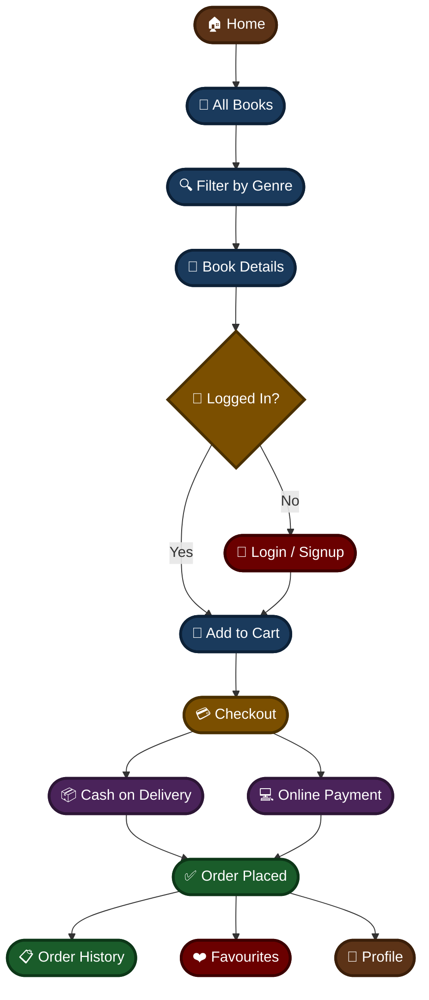

<div align="center">


# ScriptAura

#### *Where Stories Find Their Readers*

> *Unlock worlds hidden between the pages and dive into stories that inspire, educate, and stay with you forever.*

<br/>

[](https://reactjs.org/)
[](https://vitejs.dev/)
[](https://nodejs.org/)
[](https://mongodb.com/)
[](https://expressjs.com/)
[](https://tailwindcss.com/)
[](https://redux.js.org/)
[](https://vercel.com/)
[](https://render.com/)

<br/>

[](https://script-aura.vercel.app)

</div>

---

## 🌐 Live Demo

| 🔗 Resource | 🌍 URL |
|---|---|
| 🎨 Frontend | [script-aura.vercel.app](https://script-aura.vercel.app) |
| 🖥️ Backend API | [scriptaura.onrender.com](https://scriptaura.onrender.com) |

> ⚠️ **Note:** The payment gateway is a **mock/demo integration** — no real transactions are processed. Feel free to explore it freely!

---

## 📸 Screenshots

### 🏠 Homepage


### 📖 All Books


### 🛒 Cart & Checkout


### 👤 Profile & Order History


---

## ❓ Problem Statement

Book lovers often struggle to find a single platform that offers seamless browsing, purchasing, and personalization. ScriptAura centralizes all of this into one elegant full-stack experience with AI-powered assistance and a beautiful UI.

---

## ✨ Features

### 👤 User
- 🔐 Secure JWT Authentication (Signup / Login)
- 🔍 Browse & filter books by genre
- ❤️ Save favourites & manage wishlist
- 🛒 Add to cart & manage orders
- 📦 View order history (COD + Online)
- 👤 Profile with custom avatar selection
- 🤖 Built-in AI assistant (Zoiiee)
- 📱 Fully responsive on all devices

### 🛠️ Admin
- 📚 Add, edit & delete books
- 📊 Manage all user orders
- 🖼️ Upload book covers

---

## ⚙️ Tech Stack

| Layer | Technology |
|---|---|
| 🎨 Frontend | React 19, Vite, Tailwind CSS, Redux Toolkit |
| 🖥️ Backend | Node.js, Express.js |
| 🗄️ Database | MongoDB, Mongoose |
| 🔐 Auth | JWT (JSON Web Tokens) |
| 🤖 AI | Built-in AI Assistant (Zoiiee) |
| 🚀 Deployment | Vercel (Frontend) • Render (Backend) |
| ⏱️ Uptime | UptimeRobot |

---

## 🏗️ Architecture

```mermaid
graph TD
    A[👤 User - Browser] -->|HTTPS Request| B[🎨 React Frontend - Vercel]
    B -->|REST API via Axios| C[🖥️ Express.js Backend - Render]
    C -->|Mongoose ODM| D[(🗄️ MongoDB Atlas)]
    C -->|JWT Verify| E[🔐 Auth Middleware]
    B -->|Redux State| F[📦 Redux Store]
    C -->|JSON Response| B

style A fill:#C71585,stroke:#333,stroke-width:2px
style B fill:#0077B6,stroke:#333,stroke-width:2px
style C fill:#2D6A4F,stroke:#333,stroke-width:2px
style D fill:#1B5E20,stroke:#333,stroke-width:2px
style E fill:#B8860B,stroke:#333,stroke-width:2px
style F fill:#4A235A,stroke:#333,stroke-width:2px
```



---

## 👤 User Flow



## 📁 Folder Structure

```
ScriptAura/
├── 🖥️ backend/
│   ├── conn/           # 🔌 Database connection
│   ├── models/         # 📋 Mongoose schemas
│   │   ├── user.js
│   │   ├── book.js
│   │   ├── order.js
│   │   ├── cart.js
│   │   └── favourite.js
│   ├── routes/         # 🛣️ API routes
│   │   ├── user.js
│   │   ├── book.js
│   │   ├── cart.js
│   │   ├── order.js
│   │   └── favourites.js
│   └── app.js          # 🚀 Entry point
│
└── 🎨 frontend/
    ├── src/
    │   ├── components/ # 🧩 Reusable UI components
    │   ├── pages/      # 📄 Page components
    │   ├── store/      # 📦 Redux store & slices
    │   └── utils/      # 🔧 API config (axios instance)
    ├── public/         # 🖼️ Static assets
    └── index.html
```

---

## 🚀 Installation

### Prerequisites
- Node.js v18+
- MongoDB (local or Atlas)

### 1. Clone the Repository

```bash
git clone https://github.com/dhruvim-03/ScriptAura.git
cd ScriptAura
```

### 2. Backend Setup

```bash
cd backend
npm install
node app.js
```

### 3. Frontend Setup

```bash
cd frontend
npm install
npm run dev
```

---

## 🔑 Environment Variables

Create a `.env` file in the `backend/` directory:

```env
PORT=1000
MONGO_URI=your_mongodb_connection_string
JWT_SECRET=your_jwt_secret
```

Create a `.env` file in the `frontend/` directory:

```env
VITE_API_URL=https://scriptaura.onrender.com
```

---

## 🌐 API Overview

| Endpoint | Method | Description |
|---|---|---|
| `/api/v1/sign-up` | POST | User Registration |
| `/api/v1/sign-in` | POST | User Login |
| `/api/v1/get-all-books` | GET | Fetch all books |
| `/api/v1/get-recent-books` | GET | Recently added books |
| `/api/v1/add-to-cart` | PUT | Add book to cart |
| `/api/v1/get-user-cart` | GET | Get user cart |
| `/api/v1/place-order` | POST | Place an order |
| `/api/v1/get-order-history` | GET | User order history |
| `/api/v1/add-book` | POST | Admin: Add new book |
| `/api/v1/update-book` | PUT | Admin: Update book |
| `/api/v1/delete-book` | DELETE | Admin: Delete book |

---

## 🚀 Deployment

| Layer | Platform | URL |
|---|---|---|
| Frontend | Vercel | [script-aura.vercel.app](https://script-aura.vercel.app) |
| Backend | Render (Free) | [scriptaura.onrender.com](https://scriptaura.onrender.com) |
| Database | MongoDB Atlas | Cloud hosted |
| Uptime | UptimeRobot | Keeps backend awake 24/7 |

---

## 🔮 Future Enhancements

- ⭐ Book ratings & reviews
- 🔎 Search functionality
- 📧 Order confirmation emails
- 💳 Real payment gateway (Razorpay)
- 📱 Mobile app (React Native)
- 🌙 Dark / Light mode toggle

---

## 👩‍💻 Contributors

- **Dhruvi** — Full Stack Developer

---

## 🙏 Acknowledgements

- [MongoDB](https://mongodb.com)
- [Express.js](https://expressjs.com)
- [React](https://reactjs.org)
- [Node.js](https://nodejs.org)
- [Tailwind CSS](https://tailwindcss.com)
- [Vercel](https://vercel.com)
- [Render](https://render.com)

---

## 📬 Contact

- 🐙 **GitHub:** [@dhruvim-03](https://github.com/dhruvim-03)
- 💼 **LinkedIn:** [Dhruvi Mishra](https://www.linkedin.com/in/dhruvi-mishra-a86115288)
- ✉️ **Email:** dhruvimishra23@gmail.com

---

<div align="center">

Made with ❤️ by **Dhruvi** &nbsp;•&nbsp; © 2026 ScriptAura

⭐ If you liked this project, please give it a star!

</div>
